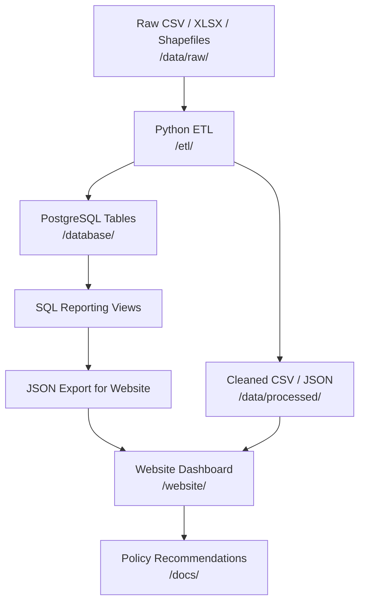

# MC3 Data Hub — System Architecture

This document describes the planned end-to-end architecture for the Monroe County Childhood Conditions Summit 2025 Data Hub portfolio project.

**Reference site:** [mc3-monroecounty2025.netlify.app](https://mc3-monroecounty2025.netlify.app/)

---

## Architecture Diagram

```
Existing Raw Data
        ↓
Python ETL Pipeline
        ↓
Cleaned CSV / JSON Outputs
        ↓
PostgreSQL Tables
        ↓
SQL Reporting Views
        ↓
Website Dashboard
        ↓
Policy Recommendations
```

---

## Layer-by-Layer Explanation

### 1. Existing Raw Data Layer

**What it is:** The original Monroe County datasets — ACS census tables, education spreadsheets, social services files, unemployment estimates, and census tract shapefiles.

**Where it lives today:**

| Location | Contents |
|----------|----------|
| `data/raw/acs/reference_repo/` | Organized ACS demographics (copied from `reference-repo/`) |
| `data/raw/economy/reference_repo/` | Unemployment estimates |
| `data/raw/education/reference_repo/` | Graduation rates, enrollment, suspensions |
| `data/raw/social_services/reference_repo/` | SNAP, TANF, foster care, juvenile cases |
| `data/raw/geography/reference_repo/` | Census tract shapefiles (2010 and 2024) |
| `data/raw/misc/dataset_archive/` | Flat DATASET download (all source files) |

**Original sources (untouched):**

- `reference-repo/` — organized source data with `rules.md` governance
- `DATASET-20251012T022637Z-1-001/` — flat downloaded archive
- `target-repo/data/processed/` — pre-built dashboard JSON

**Rule:** Raw files are read-only. ETL pipelines read from `/data/raw/` and never modify originals.

---

### 2. ETL Layer (Python)

**What it is:** Repeatable Python pipelines that extract raw files, clean and validate them, and produce standardized outputs.

**Current state (Phase 1):** Placeholder at `/etl/`. Existing scripts remain in `target-repo/`:

- `data_analysis_simple.py` — generates JSON for charts
- `data_analysis.py` — fuller analysis version
- `generate_pdf_visualizations.py` — PDF chart extraction

**Planned state (Phase 2+):**

```
etl/
├── extract/       # Read CSV, XLSX, shapefiles from /data/raw
├── transform/     # Clean, join, validate, aggregate
├── load/          # Write to PostgreSQL + export JSON
└── pipelines/     # Runnable jobs with logging and metadata
```

**Portfolio skills demonstrated:** Python data engineering, validation, reproducible pipelines, data lineage.

---

### 3. Processed Data Layer

**What it is:** Cleaned, analysis-ready files produced by ETL — intermediate CSV/JSON with run metadata (timestamp, row counts, source version).

**Current state (Phase 1):**

- `data/processed/existing_dashboard_json/` — 13 JSON files copied from `target-repo/data/processed/`
- `website/data/processed/` — same JSON files, used directly by the live dashboard

**Planned state:** ETL will write new cleaned outputs to `/data/processed/` with manifests. The website will consume verified exports.

**Rule:** Any sample or fallback data must include `"sample_data": true` in metadata. No fabricated impact metrics.

---

### 4. PostgreSQL Layer

**What it is:** A relational database storing structured Monroe County metrics — enabling SQL queries, joins across topics, and time-series analysis.

**Current state (Phase 1):** Placeholder at `/database/`. No database exists yet.

**Planned state (Phase 3):**

```
database/
├── schema/       # Tables: geography, demographics, education, economy, social_services
├── migrations/   # Versioned schema changes
├── views/        # Reporting views (poverty trends, graduation rates, SNAP totals)
└── seeds/        # Optional seed data (clearly labeled)
```

**Portfolio skills demonstrated:** Schema design, SQL, PostgreSQL administration, analytical views.

---

### 5. Dashboard Layer (Website)

**What it is:** The public-facing data portal — responsive HTML/CSS/JS with Chart.js visualizations, matching the MC3 Netlify reference site.

**Current state (Phase 1):** Working copy at `/website/` (copied from `target-repo/`).

```
website/
├── index.html              # Homepage with KPI cards and featured charts
├── pages/                  # Demographics, education, economy, social services, correlations
├── css/                    # Monroe County branding (navy #003366, gold #FFB500)
├── js/                     # main.js, dataLoader.js, visualizations.js, narratives.js
├── data/processed/         # JSON files consumed by charts
└── assets/images/          # Summit branding
```

**Data flow today:** Static JSON → `dataLoader.js` → `visualizations.js` → Chart.js charts.

**Planned enhancement:** JSON exports will be generated from PostgreSQL views via ETL, ensuring dashboard numbers trace to source data.

**Portfolio skills demonstrated:** Responsive frontend, data visualization, accessibility, government-standard design.

---

### 6. Policy Recommendation Layer

**What it is:** The narrative and analytical output that translates data into actionable insights for the MC3 Summit — trend summaries, correlation findings, and evidence-based recommendations.

**Current state:** Narrative content exists in `website/js/narratives.js` and within processed JSON files (e.g., `dashboard_summary.json` key findings).

**Planned state:** SQL reporting views will power standardized KPI calculations. Documentation in `/docs/` will explain methodology and source attribution. All recommendations will cite verified data — never fabricated impact numbers.

**Portfolio skills demonstrated:** Data storytelling, policy analysis, communicating findings to non-technical stakeholders.

---

## End-to-End Data Flow (Target State)



---

## Phase Roadmap

| Phase | Focus | Status |
|-------|-------|--------|
| 0 | Project audit | Complete — see `docs/project_audit.md` |
| 1 | Scaffold portfolio structure | Complete — this document |
| 2 | Data inventory and data dictionary | Next |
| 3 | ETL pipeline refactor | Planned |
| 4 | PostgreSQL schema and load | Planned |
| 5 | Website integration and deploy | Planned |

---

## Key Constraints

1. **Do not delete** original files in `target-repo/`, `reference-repo/`, or `DATASET-.../`.
2. **Do not fabricate** impact metrics — all numbers must trace to source data or be labeled as sample.
3. **Preserve website behavior** — `/website/` must continue to work as a static site during all phases.
4. **Follow data governance** — see `reference-repo/rules.md` for Monroe County data handling rules.
